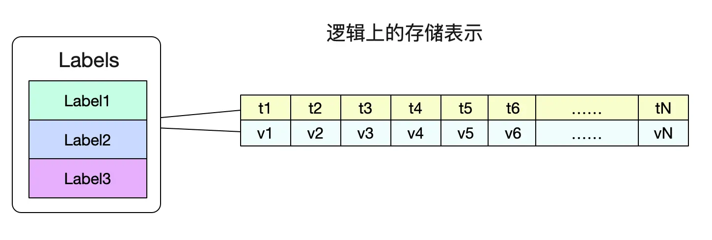
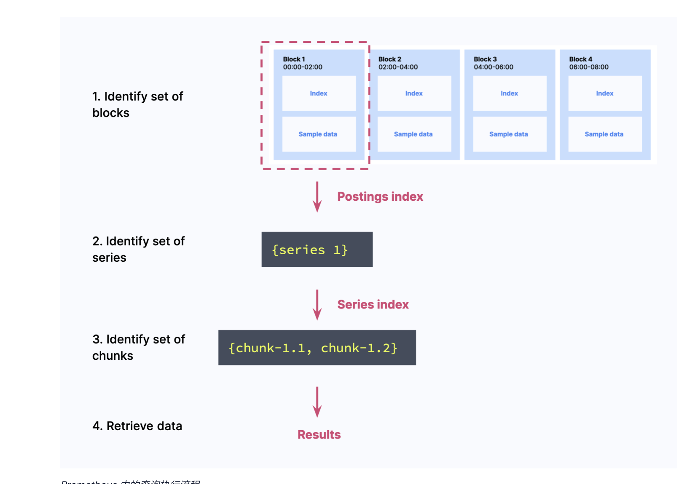

### prometheus规模参考

- ingested_samples_per_second：每秒写入的数据点:

  - rate(prometheus_tsdb_head_samples_appended_total[2h])
  - 约为61k，也近似active_time_series / scrape_interval
- Active Series：*A series with an open head chunk* is called an active series

  - prometheus_tsdb_head_series :涵盖过去 1-3 小时（在block为2h时）内存在的每个series
  - count({__name__=~".+"}) ：五分钟内内存中未过时的series
  - 约为410w
  - 不同的label会组成不同的series，series和samples是通过chunkID关联起来的，series是纯粹的label组合。
- 流失率：pod的重启等会产生新的series，频繁变换会导致容易OOM。sum(sum_over_time(scrape_series_added[5m])) by (job)
- bytes_per_sample：每个Sample大小：

  - rate(prometheus_tsdb_compaction_chunk_size_bytes_sum[2h]) /   rate(prometheus_tsdb_compaction_chunk_samples_sum[2h])
  - 约为3.1bytes
  - 官网说：Prometheus 平均每个样本仅存储 1-2 个字节，我们rancher和acp的普罗样本规模差距比较大。
- 磁盘占用量：chunks, indexes, tombstones, and various metadata
- 物理磁盘容量：needed_disk_space = retention_time_seconds *ingested_samples_per_second* bytes_per_sample，

  - 每秒钟约产生1.8M的series
  - 我们保留15天（1296000），约产生230GB的chunk数据
- gc时间：rate(prometheus_tsdb_head_gc_duration_seconds_sum[2h])/rate(prometheus_tsdb_head_gc_duration_seconds_count[2h])
- 最慢的抓取Job:  topk(10,max_over_time(scrape_duration_seconds[24h]))
- 最多Samples的Job: topk(10,max_over_time(scrape_samples_scraped[24h]))
- 最多series的metric： topk(10,count by(__name __)(__name __=~".+"))
- HTTP各个接口的延时: rate(prometheus_http_request_duration_seconds_sum[5m])

#### 内存中的数据结构

##### Samples：基本的存储单元

单个Sample没什么意义，要存储在chunks中才能和series关联起来

```golang
type sample struct {
	t int64
	v float64
}
```

##### Labels  []Labels：

- 通过一个Labels(标签们)找到对应的数据了。



##### memChunk

- HeadChunk是第一个memChunk，也就是memChunk的数据结构，不同于磁盘中的chunk的概念，是一组Samples的存储方式
- 是一个链表，其中Chunk是个interface，对不同的数据结构有不同的实现

  ```golang
  type memChunk struct {
  	chunk            chunkenc.Chunk
  	minTime, maxTime int64
  	prev             *memChunk // Link to the previous element on the list.
  }


  ```
- 比如以HistogramChunk的结构是 ：

  ```
  //	field →    ts    count zeroCount sum []posbuckets []negbuckets
  //	sample 1   raw   raw   raw       raw []raw        []raw
  //	sample 2   delta xor   xor       xor []xor        []xor
  //	sample >2  dod   xor   xor       xor []xor        []xor
  ```

##### memSeries

- 一个memSeries中有多个memChunk。

```golang
type memSeries stuct {
	......
	ref uint64 // 一个series生成的id
	lst labels.Labels // 对应的标签集合
        meta *metadata.Metadata
	// chunks []*memChunk  旧版表示数据集合
	// headChunk *memChunk 旧版的是只有正在被写入的chunk

	mmappedChunks []*mmappedChunk // 内存映射区块，指向磁盘的不可变数组，按时间戳排序，等待被压缩
	headChunks   *memChunk  //新版的是个链表，会指向全部头部中的headChunk

	......
}
```

- 不同的labels组成了不同的series，有不同的ref。

  - sereis会产生独一无二的序列号ref，便于hash查找
  - series会记录全部label，同样的label的series只会在head中被记录一次
- 

#### 为什么内存默认保留时间2h

Prometheus将最近的数据保存在内存中，这样查询最近的数据会变得非常快，然后通过一个compactor定时将数据打包到磁盘。数据在内存中最少保留2个小时(storage.tsdb.min-block-duration。至于为什么设置2小时这个值，应该是Gorilla那篇论文中观察得出的结论


即压缩率在2小时时候达到最高，如果保留的时间更短，就无法最大化的压缩。

#### 从promql到labels

直接上一条带有聚合函数的Promql把。

```csharp
SUM BY (group) (http_requests{job="api-server",group="production"})
```

首先,对于这种有语法结构的语句肯定是将其Parse一把，构造成AST树了。调用

```undefined
promql.ParseExpr
```

由于Promql较为简单，所以Prometheus直接采用了LL语法分析。在这里直接给出上述Promql的AST树结构。

Prometheus对于语法树的遍历过程都是通过vistor模式,具体到代码为:

```go
ast.go vistor设计模式
func Walk(v Visitor, node Node, path []Node) error {
	var err error
	if v, err = v.Visit(node, path); v == nil || err != nil {
		return err
	}
	path = append(path, node)

	for _, e := range Children(node) {
		if err := Walk(v, e, path); err != nil {
			return err
		}
	}

	_, err = v.Visit(nil, nil)
	return err
}
func (f inspector) Visit(node Node, path []Node) (Visitor, error) {
	if err := f(node, path); err != nil {
		return nil, err
	}

	return f, nil
}

```

通过golang里非常方便的函数式功能，直接传递求值函数inspector进行不同情况下的求值。

```haskell
type inspector func(Node, []Node) error
```

具体的求值过程核心函数为execEvalStmt:

```go
func (ng *Engine) execEvalStmt(ctx context.Context, query *query, s *EvalStmt) (Value, storage.Warnings, error) {
	......
	querier, warnings, err := ng.populateSeries(ctxPrepare, query.queryable, s) 	// 这边拿到对应序列的数据
	......
	val, err := evaluator.Eval(s.Expr) // here 聚合计算
	......
	// 很多case处理各个节点的情况
	switch s.Expr.Type() {
	......
	}

}
```

##### populateSeries

首先通过populateSeries的计算出VectorSelector Node所对应的series(时间序列)。这里直接给出求值函数

```go
 func(node Node, path []Node) error {
 	......
 	querier, err := q.Querier(ctx, timestamp.FromTime(mint), timestamp.FromTime(s.End))
 	......
 	case *VectorSelector:
 		.......
 		set, wrn, err = querier.Select(params, n.LabelMatchers...)
 		......
 		n.unexpandedSeriesSet = set
 	......
 	case *MatrixSelector:
 		......
 }
 return nil
```

可以看到这个求值函数，只对VectorSelector/MatrixSelector进行操作，针对我们的Promql也就是只对叶子节点VectorSelector有效。


##### select

获取对应数据的核心函数就在querier.Select。我们先来看下qurier是如何得到的.

```css
querier, err := q.Querier(ctx, timestamp.FromTime(mint), timestamp.FromTime(s.End))
```

根据时间戳范围去生成querier,里面最重要的就是计算出哪些block在这个时间范围内，并将他们附着到querier里面。具体见函数

```go
// Querier returns a new querier over the data partition for the given time range.
func (db *DB) Querier(mint, maxt int64) (_ storage.Querier, err error) {
	var blocks []BlockReader

	db.mtx.RLock()
	defer db.mtx.RUnlock()

	for _, b := range db.blocks {
		// 遍历blocks挑选block
		if b.OverlapsClosedInterval(mint, maxt) {
			blocks = append(blocks, b)
		}
	}

	blockQueriers := make([]storage.Querier, 0, len(blocks)+2) // +2 to allow for possible in-order and OOO head queriers

	......

	// 如果maxt>head.mint(即内存中的block),那么也加入到里面querier里面。
	if maxt >= db.head.MinTime() {
		rh := NewRangeHead(db.head, mint, maxt)
		var err error
		inOrderHeadQuerier, err := NewBlockQuerier(rh, mint, maxt)
		if err != nil {
			return nil, fmt.Errorf("open block querier for head %s: %w", rh, err)
		}

		//如果查询与头部的截断操作冲突，则会关闭当前的BlockQuerier并创建一个新的RangeHead和BlockQuerier。
		......

		if inOrderHeadQuerier != nil {
			blockQueriers = append(blockQueriers, inOrderHeadQuerier)
		}
	}


	for _, b := range blocks {
		q, err := NewBlockQuerier(b, mint, maxt)
		if err != nil {
			return nil, fmt.Errorf("open querier for block %s: %w", b, err)
		}
		blockQueriers = append(blockQueriers, q)
	}

	return storage.NewMergeQuerier(blockQueriers, nil, storage.ChainedSeriesMerge), nil
}

```


知道数据在哪些block里面，我们就可以着手进行计算VectorSelector的数据了。

```css
 // labelMatchers {job:api-server} {__name__:http_requests} {group:production}
 querier.Select(params, n.LabelMatchers...)
```

有了matchers我们很容易的就能够通过倒排索引取到对应的series。目标如下：


#### 快速根据matchers(label)定位memSeries

- 通过Hash的方式，每个LabelSet对应一个Hash值，因此每个Label能够找到若干个memSeries，然后取一个交集
- 由于在Prometheus中会频繁的对map[hash/refId]memSeries进行操作，例如检查这个labelSet对应的memSeries是否存在，不存在则创建等。由于golang的map非线程安全，所以其采用了分段锁去拆分锁。
  ```golang
  // 以分片方式管理序列数据，旨在减少锁竞争并提升并发处理能力。
  // 它包含多个分片，每个分片具有自己的series、哈希表、Samples、lock
  type stripeSeries struct {
      // size indicates the number of stripes in this structure.
      size int

      // 记录refId到memSeries的映射,这里的memSeries不包括Samples，都是Labels
      series []map[chunks.HeadSeriesRef]*memSeries

      // hashes is an array of hashmap structures, used for quickly locating series references.记录hash值到memSeries,hash冲突采用拉链法
      hashes []seriesHashmap

      //  记录refId到Samples的映射
      exemplars []map[chunks.HeadSeriesRef]*exemplar.Exemplar

      // locks is an array of locks, each corresponding to a stripe, used to control concurrent access to stripe data.分段锁
      locks []stripeLock

      // gcMut is a mutex used specifically for garbage collection operations to ensure thread safety.
      gcMut sync.Mutex
  }
  ```
- 

##### 倒排索引

假设有下面这样的指标集合，于标签取值不同，我们会有四种不同的memSeries：

```
{__name__:http_requests}{group:canary}{instance:0}{job:api-server}   
{__name__:http_requests}{group:canary}{instance:1}{job:api-server}
{__name__:http_requests}{group:production}{instance:1}{job,api-server}
{__name__:http_requests}{group:production}{instance:0}{job,api-server}
```

memSeries在内存中会有4种，同时内存中还夹杂着其它监控项的series：


如果没有倒排索引，那么我们必须遍历内存中所有的memSeries(数万乃至数十万)，一一按照Labels去比对,这显然在性能上是不可接受的。而有了倒排索引，我们就可以通过求交集的手段迅速的获取需要哪些memSeries。


注意，这边倒排索引存储的refId必须是有序的。这样，我们就可以在O(n)复杂度下顺利的算出交集。

- 每次新增一个reries，都要把这个新增的标签的series加入倒排索引

  ```golang

  func (h *Head) getOrCreateWithID(id chunks.HeadSeriesRef, hash uint64, lset labels.Labels) (*memSeries, bool, error) {
  	...//创建series

  	h.metrics.seriesCreated.Inc()
  	h.numSeries.Inc()

  	h.postings.Add(storage.SeriesRef(id), lset)
  	return s, true, nil
  }

  ```

##### evaluator.Eval

通过populateSeries找到对应的数据，那么我们就可以通过evaluator.Eval获取最终的结果了。计算采用后序遍历，等下层节点返回数据后才开始上层节点的计算。那么很自然的，我们先计算VectorSelector。

```go
// eval evaluates the given expression as the given AST expression node requires.
func (ev *evaluator) eval(expr parser.Expr) (parser.Value, annotations.Annotations) {
	......
	case *VectorSelector:
	// 通过refId拿到对应的Series
	checkForSeriesSetExpansion(ev.ctx, e)
	// 遍历所有的series
	for i, s := range e.series {
			// 如果是instant query,所以只循环一次
			for ts, step := ev.startTimestamp, -1; ts <= ev.endTimestamp; ts += ev.interval {
				step++
				// 获取距离ts最近且小于ts的最近的sample
				_, f, h, ok := ev.vectorSelectorSingle(it, e, ts)
				if ok {
					if h == nil {
						ev.currentSamples++
						ev.samplesStats.IncrementSamplesAtStep(step, 1)
						if ev.currentSamples > ev.maxSamples {
							ev.error(ErrTooManySamples(env))
						}
						if ss.Floats == nil {
							ss.Floats = reuseOrGetFPointSlices(prevSS, numSteps)
						}
						// 注意，这边的F对应的原始t被替换成了ts,也就是instant query timeStamp
						ss.Floats = append(ss.Floats, FPoint{F: f, T: ts})
			......
		}
	}
}
```

如代码注释中看到，当我们找到一个距离ts最近切小于ts的sample时候，只用这个sample的value,其时间戳则用ts(Instant Query指定的时间戳)代替。

其中vectorSelectorSingle值得我们观察一下:

```golang
// vectorSelectorSingle evaluates an instant vector for the iterator of one time series.
func (ev *evaluator) vectorSelectorSingle(it *storage.MemoizedSeriesIterator, node *parser.VectorSelector, ts int64) (
	int64, float64, *histogram.FloatHistogram, bool,
) {
	refTime := ts - durationMilliseconds(node.Offset)
	var t int64
	var v float64
	var h *histogram.FloatHistogram

	// 这一步是获取>=refTime的数据，也就是我们instant query传入的
	valueType := it.Seek(refTime)
	switch valueType {
	case chunkenc.ValNone:
		if it.Err() != nil {
			ev.error(it.Err())
		}
	case chunkenc.ValFloat:
		t, v = it.At()
	case chunkenc.ValFloatHistogram:
		t, h = it.AtFloatHistogram()
	default:
		panic(fmt.Errorf("unknown value type %v", valueType))
	}
	// 由于我们需要的是<=refTime的数据，所以这边回退一格，由于同一memSeries同一时间的数据只有一条，所以回退的数据肯定是<=refTime的
	if valueType == chunkenc.ValNone || t > refTime {
		var ok bool
		t, v, h, ok = it.PeekPrev()
		if !ok || t < refTime-durationMilliseconds(ev.lookbackDelta) {
			return 0, 0, nil, false
		}
	}
	if value.IsStaleNaN(v) || (h != nil && value.IsStaleNaN(h.Sum)) {
		return 0, 0, nil, false
	}
	return t, v, h, true
}


```

就这样，我们找到了series 3和4距离Instant Query时间最近且小于这个时间的两条记录，并保留了记录的标签。这样，我们就可以在上层进行聚合。


##### SUM by聚合

叶子节点VectorSelector得到了对应的数据后，我们就可以进入*parser.AggregateExpr分支对上层节点AggregateExpr进行聚合计算了。代码栈为:

```rust
evaluator.rangeEval
	|->evaluate.eval.func2
		|->evelator.aggregation grouping key为group
```

具体的函数如下图所示:

```go
unc (ev *evaluator) aggregation(e *parser.AggregateExpr, q float64, inputMatrix, outputMatrix Matrix, seriesToResult []int, groups []groupedAggregation, enh *EvalNodeHelper) annotations.Annotations {
	......
	// 对所有的sample
	for _, s := range vec {
		metric := s.Metric
		......
		group, ok := result[groupingKey] 
		// 如果此group不存在，则新加一个group
		if !ok {
			......
			result[groupingKey] = &groupedAggregation{
				labels:     m, // 在这里我们的m=[group:production]
				value:      s.V,
				mean:       s.V,
				groupCount: 1,
			}
			......
		}
		switch op {
		// 这边就是对SUM的最终处理
		case SUM:
			group.value += s.V
		.....
		}
	}
	.....
	for _, aggr := range result {
		enh.out = append(enh.out, Sample{
		Metric: aggr.labels,
		Point:  Point{V: aggr.value},
		})
	}
	......
	return enh.out
}
```

好了，有了上面的处理，我们聚合的结果就变为:

这个和我们的预期结果一致,一次查询的过程就到此结束了。

### 磁盘存储数据结构

./data
├── 01BKGV7JBM69T2G1BGBGM6KB12
│   └── meta.json
├── 01BKGTZQ1SYQJTR4PB43C8PD98
│   ├── chunks
│   │   └── 000001
│   ├── tombstones
│   ├── index
│   └── meta.json
├── 01BKGTZQ1HHWHV8FBJXW1Y3W0K

│   └── meta.json
├── 01BKGV7JC0RY8A6MACW02A2PJD
│   ├── chunks
│   │   └── 000001
│   ├── tombstones
│   ├── index
│   └── meta.json
├── chunks_head
│   └── 000001
└── wal
    ├── 000000002
    └── checkpoint.00000001
        └── 00000000

- 通过API做删除时，是软删除，不会立刻清理数据块的内容，而是记录再墓碑中
- 一些概念：

  - [https://www.timescale.com/blog/content/images/2022/06/Figure_1_Prometheus_querying.png](
- 一些prometheus自身监控的关键指标：

  - prometheus_engine_queries：查询处理器处理的请求数量
  - prometheus_engine_query_duration_seconds：单个查询的处理时间
  - prometheus_http_request_duration_seconds_bucket：HTTP请求持续时间的分位数桶计数

  * prometheus_tsdb_head_chunks_created_total是counter类型的指标，其值会一直增加，含义是[时序数据库](https://cloud.tencent.com/product/ctsdb?from_column=20065&from=20065)tsdb的head中创建的chunk数量
  * https://blog.csdn.net/weixin_43757402/article/details/129302560
  * **go_memstats_alloc_bytes** – 该指标展示了在 [堆](https://en.wikipedia.org/wiki/Memory_management#HEAP) 上为对象分配了多少字节的内存。该值与 **go_memstats_heap_alloc_bytes** 相同。该指标包括所有可达（reachable）堆对象和不可达(unreachable)对象(GC尚未释放的）占用的内存大小。
- 存储逻辑：https://www.slideshare.net/slideshow/how-prometheus-store-the-data/243217570 （prometheus交流大会PPT)
- 查询工作原理：https://www.timescale.com/blog/how-prometheus-querying-works-and-why-you-should-care/

#### WAL相关概念

##### Sample Record

- samples Record记录所属的series的ID，为了确保每个sample都能找到所属的series，会先写入series再写入sample
- The Samples record is written for all write requests that contain a sample.

##### WAL

- Head中先创建sereis，再写入record，samples是先写入record，再在head中创建
- 先创建墓碑，再适时删除
- WAL的删除发生在块压缩时
- 先写入WAL，再执行
- 因为series是一次写入，为了避免被频繁删除，每次只删除2/3的segments.，并留下一个checkpoint
  - 所选文本中讨论了在Prometheus的TSDB中，对于那些不再在Head Block中的系列记录，以及在特定时间点T之前的所有样本和墓碑记录如何处理。具体包括以下几点：
    1. 删除所有不再在Head Block中的系列记录。
    2. 删除所有在时间点T之前的样本。
    3. 删除所有在时间点T之前的墓碑记录。
    4. 保留剩余的系列、样本和墓碑记录，按照它们在WAL中出现的顺序保持不变。
    5. checkpoint.X where X is the last segment number on which the checkpoint was being created ，If there were any older checkpoints, they are deleted at this point.
  - 代码引用
    - WAL（Write-Ahead-Log）的实现和逻辑分布信息。在tsdb/wal/wal.go文件中，包含了处理字节记录、进行低级磁盘交互的WAL实现。该文件负责编写字节记录并迭代记录（同样以字节片段形式）。tsdb/record/record.go文件则包含了具有其编码和解码逻辑的各种记录。而关于检查点逻辑则在tsdb/wal/checkpoint.go文件中。tsdb/head.go文件涵盖了创建和编码记录、调用WAL写入，调用检查点和WAL截断，以及重放WAL记录、解码它们并恢复内存状态的剩余部分。

#### prometheus的mmap

- 2.19开始使用mmap技术。新特性：https://grafana.com/blog/2020/06/10/new-in-prometheus-v2.19.0-memory-mapping-of-full-chunks-of-the-head-block-reduces-memory-usage-by-as-much-as-40/

#### meta.json

我们可以通过检查meta.json来得到当前Block的一些元信息，该Block是由31个原始Block经历5次压缩而来。最后一次压缩的三个Block ulid记录在parents中。如下图所示:

```
"ulid":"01EXTEH5JA3QCQB0PXHAPP999D",
	// maxTime - maxTime =>162h
	"minTime":1610964800000,
	"maxTime":1611548000000
	......
	"compaction":{
		"level": 5,
		"sources: [
			31个01EX......
		]
	},
	"parents: [
		{
			"ulid": 01EXTEH5JA3QCQB1PXHAPP999D
			...
		}
		{
			"ulid": 01EXTEH6JA3QCQB1PXHAPP999D
			...
		}
				{
			"ulid": 01EXTEH5JA31CQB1PXHAPP999D
			...
		}
	]
```

#### chunks

##### CUT文件切分

所有的Chunk文件在磁盘上都不会大于512M,对应的源码为:

```golang
func (w *Writer) WriteChunks(chks ...Meta) error {
	......
	for i, chk := range chks {
		cutNewBatch := (i != 0) && (batchSize+SegmentHeaderSize > w.segmentSize)
		......
		if cutNewBatch {
			......
		}
		......
	}
}
```

一个Chunks文件包含了非常多的内存Chunk结构,如下图所示:


我们怎么在chunks中找到series对应Chunk的。

在index中，通过series记录的chunks的文件名(000001，前32位)以及(offset,后32位)编码到一个int类型的refId中，使得我们可以轻松的通过这个id获取到对应的chunk块。

##### chunks文件通过mmap去访问

由于chunks文件大小基本固定(最大512M),所以我们很容易的可以通过mmap去访问对应的数据。直接将对应文件的读操作交给操作系统，既省心又省力。对应代码为:

```golang
func NewDirReader(dir string, pool chunkenc.Pool) (*Reader, error) {
	......
	for _, fn := range files {
		f, err := fileutil.OpenMmapFile(fn)
		......
	}
	......
	bs = append(bs, realByteSlice(f.Bytes()))
}
通过sgmBytes := s.bs[offset]就直接能获取对应的数据
```

#### 如何通过index逐渐找到需要的数据

前面介绍完chunk文件，我们就可以开始阐述最复杂的索引结构了。

##### 查询流程（概览版)

先查找块（可能是head的在内存中，也可能是磁盘的block），再在索引中找到label的倒排索引，根据倒排索引（label的HashID)找到符合条件的memSeries（refID)，然后根据series中的索引，找到对应的chunk，再组合返回



##### 找到block

索引就是为了让我们快速的找到想要的内容，为了便于理解，这里通过一次数据的寻址来探究Prometheus的磁盘索引结构。考虑查询一个拥有三个标签的series的查询：

```css

({__name__:http_requests}{job:api-server}{instance:0})
且时间为start/end的所有序列数据
```

我们先从选择Block开始,遍历所有Block的meta.json，根据start/end找到具体的Block

前文说了，通过Labels找数据是通过倒排索引。我们的倒排索引是保存在index文件里面的。 那么怎么在这个单一文件里找到倒排索引的位置呢？这就引入了TOC(Table Of Content)

##### 找到倒排索引表的位置，TOC(Table Of Content)


由于index文件一旦形成之后就不再会改变，所以Prometheus也依旧使用mmap来进行操作。采用mmap读取TOC非常容易:

```go
func NewTOCFromByteSlice(bs ByteSlice) (*TOC, error) {
	......
	// indexTOCLen = 6*8+4 = 52
	b := bs.Range(bs.Len()-indexTOCLen, bs.Len())
	......
	return &TOC{
		Symbols:           d.Be64(),
		Series:            d.Be64(),
		LabelIndices:      d.Be64(),
		LabelIndicesTable: d.Be64(),
		Postings:          d.Be64(),
		PostingsTable:     d.Be64(),
	}, nil
}
```

##### 找到对应的倒排索引的位置--Posting offset table

首先我们访问的是**Posting offset table**。由于倒排索引按照不同的LabelPair(key/value)会有非常多的条目。所以Posing offset table就是决定到底访问哪一条Posting索引。offset就是指的这一Posting条目在文件中的偏移。


##### 根据Posting倒排索引找到对应的Series

我们通过三条Postings倒排索引索引取交集得出

```undefined
{series1,Series2,Series3,Series4}
∩
{series1,Series2,Series3}
∩
{Series2,Series3}
=
{Series2,Series3}
```

也就是要读取Series2和Serie3中的数据，而Posting中的Ref(Series2)和Ref(Series3)即为这两Series在index文件中的偏移。

Series以Delta的形式记录了chunkId以及该chunk包含的时间范围。

##### 根据series查找chunk

这样就可以很容易过滤出我们需要的chunk,然后再按照chunk文件的访问，即可找到最终的原始数据。

##### SymbolTable

值得注意的是，为了尽量减少我们文件的大小，对于Label的Name和Value这些有限的数据，我们会按照字母序存在符号表中。由于是有序的，所以我们可以直接将符号表认为是一个
[]string切片。然后通过切片的下标去获取对应的sting。考虑如下符号表:

读取index文件时候，会将SymbolTable全部加载到内存中，并组织成symbols []string这样的切片形式，这样一个Series中的所有标签值即可通过切片下标访问得到。

##### Label Index以及Label Table

事实上，前面的介绍已经将一个普通数据寻址的过程全部讲完了。但是index文件中还包含label索引以及label Table，这两个是用来记录一个Label下面所有可能的值而存在的。
这样，在正则的时候就可以非常容易的找到我们需要哪些LabelPair。详情可以见前篇。


事实上，真正的Label Index比图中要复杂一点。它设计成一条LabelIndex可以表示(多个标签组合)的所有数据。不过在Prometheus代码中只会采用存储一个标签对应所有值的形式。

##### 完整的index文件结构

这里直接给出完整的index文件结构，摘自Prometheus中index.md文档。

```css
┌────────────────────────────┬─────────────────────┐
│ magic(0xBAAAD700) <4b>     │ version(1) <1 byte> │
├────────────────────────────┴─────────────────────┤
│ ┌──────────────────────────────────────────────┐ │
│ │                 Symbol Table                 │ │
│ ├──────────────────────────────────────────────┤ │
│ │                    Series                    │ │
│ ├──────────────────────────────────────────────┤ │
│ │                 Label Index 1                │ │
│ ├──────────────────────────────────────────────┤ │
│ │                      ...                     │ │
│ ├──────────────────────────────────────────────┤ │
│ │                 Label Index N                │ │
│ ├──────────────────────────────────────────────┤ │
│ │                   Postings 1                 │ │
│ ├──────────────────────────────────────────────┤ │
│ │                      ...                     │ │
│ ├──────────────────────────────────────────────┤ │
│ │                   Postings N                 │ │
│ ├──────────────────────────────────────────────┤ │
│ │               Label Index Table              │ │
│ ├──────────────────────────────────────────────┤ │
│ │                 Postings Table               │ │
│ ├──────────────────────────────────────────────┤ │
│ │                      TOC                     │ │
│ └──────────────────────────────────────────────┘ │
└──────────────────────────────────────────────────┘
```

#### tombstones

由于Prometheus Block的数据一般在写完后就不会变动。如果要删除部分数据，就只能记录一下删除数据的范围，由下一次compactor组成新block的时候删除。而记录这些信息的文件即是tomstones。
